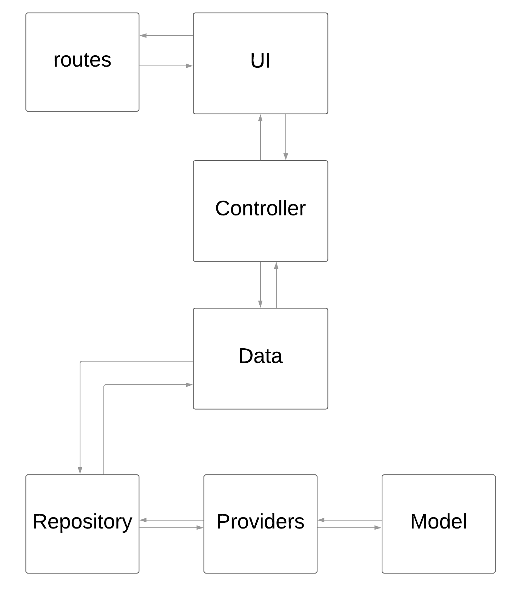

# flutter_template
 
## 编译运行流程
1、配置好Flutter开发环境(目前Flutter SDK 版本 **2.0**)
2、clone代码，执行`Packages get`安装第三方包
3、运行: `flutter run `

### 下载
| 类型          | 二维码                                      |
| ----------- | ---------------------------------------- |
| **Apk二维码**  |  |
| **iOS暂无下载** | |
| **web链接** | |

## 项目结构图 

### 常见问题

### 示例图片

### 第三方框架

>当前 Flutter SDK 版本 2.0.5

| 库                          | 功能             |
| -------------------------- | -------------- |
| **dio**                    | **网络框架**       |
| **shared_preferences**     | **本地数据缓存**     |
| **fluttertoast**           | **toast**      |
| **device_info**            | **设备信息**       |
| **connectivity**           | **网络链接**       |
| **url_launcher**           | **启动外部浏览器**    |
| **share**                  | **系统分享**       |
| **get_version**            | **版本信息**       |
| **flutter_webview_plugin** | **全屏的webview** |
| **sqflite**                | **数据库**        |
| **photo_view**             | **图片预览**       |
| **flutter_slidable**       | **侧滑**         |
| **path_provider**          | **本地路径**       |
| **permission_handler**     | **权限**         |

### 进行中：

### 注意点：